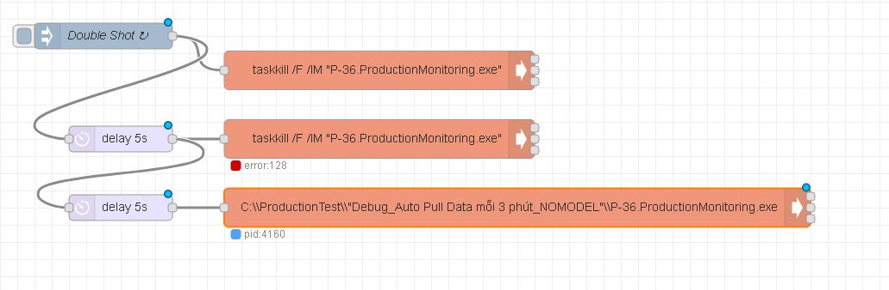

# Untitled

Double Shoot

* vnmsrv859



```javascript
[{"id":"9cb43636.928f58","type":"exec","z":"bba1ee86.619b8","command":"C:\\\\ProductionTest\\\\\"Debug_Auto Pull Data mỗi 3 phút_NOMODEL\"\\\\P-36.ProductionMonitoring.exe","addpay":true,"append":"","useSpawn":"false","timer":"","oldrc":false,"name":"","x":620,"y":260,"wires":[[],[],[]]}]
```


